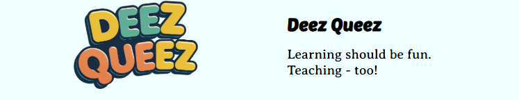
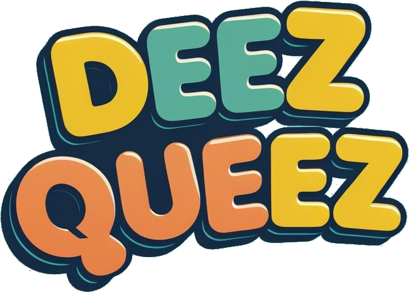

# Deez Queez
> An easy-to-use quiz platform for teachers

[]


🌐 **Live Demo**:  
<a href="https://dqueez.com" target="_blank">
  
</a>


## Table of Contents

- [About](#about)
- [Features](#features)
- [Getting Started](#getting-started)
- [Installation](#installation)
- [Usage](#usage) 
- [Project Structure](#project-structure) 
- [License](#license)
- [Changelog](#changelog)

## About

Deez Queez is a web-based quiz platform designed to streamline the process of creating, distributing, and managing quizzes in educational environments. Teachers can create custom quizzes with multiple question types, manage student access through unique URLs, and track responses in real-time.

*This project was created as part of a school assignment by a collaborative development team.*

### Team Members

- Joshua Gould ([@birtheater](https://github.com/birtheater))
- Aldebaraan Canedo Sosa ([@aldebaraan97](https://github.com/aldebaraan97))
- Melissa Louise Bangloy ([@melissa0987](https://github.com/melissa0987))
- Alexandre Kharlamov ([@alexkh](https://github.com/alexkh))
- Daniel Li ([@DanielCrane292](https://github.com/DanielCrane292))

### Built With

- Node.js
- Express.js
- PostgreSQL
- JavaScript
- HTML/CSS

## Features

- ✅ Multiple question types (multiple choice, checkboxes, numeric, text)
- ✅ Time-controlled quiz availability
- ✅ Individual student URLs with ID verification
- ✅ Real-time response tracking 
- ✅ Persistent data storage

## Getting Started

### Prerequisites

- Node.js (version 14 or higher)
- PostgreSQL database
- npm or Make

### Installation

Clone the repository:

```bash
git clone git@github.com:alexkh/dqueez.git
cd dqueez/server
```

Set up your PostgreSQL database and configure connection settings in your environment or configuration files.

#### Option 1: Using Make 

```bash
make install
make run

#for developement:
    make dev 

```

*make is not required but it unifies devops across devstacks

#### Option 2: Using npm

```bash
npm ci
node server.js

#for developement:
    nodemon server.js

```
 
The application will be available at ```  http://localhost:3232      ```

## Usage

### For Teachers

1. Create a new quiz with custom questions
2. Set quiz availability timeframe
3. Add students by their student IDs
4. Generate and distribute individual quiz URLs
5. Monitor student responses in real-time

### For Students

1. Access quiz via provided URL by the teacher
2. Enter student ID to verify identity
3. Complete quiz within the specified timeframe
4. Submit responses

### Question Types

- **Radio buttons**: Single-choice questions
- **Checkboxes**: Multiple-choice questions
- **Numeric**: Number-based answers
- **Text**: Single word or short text responses
 

## Project Structure

```
dqueez/
├── server/
│   ├── node_modules/           # Dependencies
│   ├── public/                 # Static assets
│   │   ├── css/
│   │   │   └── main.css        # Main stylesheet
│   │   ├── Deliverables/
│   │   │   └── system_dev_final_...
│   │   ├── img/                # Images
│   │   └── js/                 # Client-side JavaScript
│   │       ├── conduct.js
│   │       ├── edit.js         # Quiz editing functionality
│   │       ├── new_exam.js
│   │       └── question_ops.js # Shared question functions
│   ├── conduct.html            # Quiz taking interface
│   ├── edit.html               # Quiz editing interface
│   ├── index.html              # Main landing page
│   ├── db.js                   # PostgreSQL database operations
│   ├── Makefile                # Build automation
│   ├── package-lock.json       # Locked dependencies
│   ├── package.json            # Project dependencies
│   └── server.js               # Main application server
└── README.md
```
 
## License

MIT License

Copyright (c) 2025 Joshua Gould, Aldebaraan Canedo Sosa, Melissa Louise Bangloy, Alexandre Kharlamov, Daniel Li

Permission is hereby granted, free of charge, to any person obtaining a copy
of this software and associated documentation files (the "Software"), to deal
in the Software without restriction, including without limitation the rights
to use, copy, modify, merge, publish, distribute, sublicense, and/or sell
copies of the Software, and to permit persons to whom the Software is
furnished to do so, subject to the following conditions:

The above copyright notice and this permission notice shall be included in all
copies or substantial portions of the Software.

THE SOFTWARE IS PROVIDED "AS IS", WITHOUT WARRANTY OF ANY KIND, EXPRESS OR
IMPLIED, INCLUDING BUT NOT LIMITED TO THE WARRANTIES OF MERCHANTABILITY,
FITNESS FOR A PARTICULAR PURPOSE AND NONINFRINGEMENT. IN NO EVENT SHALL THE
AUTHORS OR COPYRIGHT HOLDERS BE LIABLE FOR ANY CLAIM, DAMAGES OR OTHER
LIABILITY, WHETHER IN AN ACTION OF CONTRACT, TORT OR OTHERWISE, ARISING FROM,
OUT OF OR IN CONNECTION WITH THE SOFTWARE OR THE USE OR OTHER DEALINGS IN THE
SOFTWARE.

## Changelog

### June 19, 2025
- Updated project documentation and README structure
- Enhanced project setup instructions with PostgreSQL integration
- Improved code organization and documentation

### June 18, 2025

- Added `question_ops.js` for reusable question generation logic
- Introduced `gen_questions_div()` to render quizzes from JSON
- Replaced old `add_question()` logic with `gen_question_*()` functions:
  - `gen_question_radio()` - Multiple choice questions
  - `gen_question_check()` - Multiple select questions
  - `gen_question_number()` - Numeric answer questions
  - `gen_question_word()` - Single word answer questions
- Enabled teacher edit mode by passing points to generator functions
- Separated logic for teacher vs student rendering

---

**🚀 Ready to try it out?** Visit [https://dqueez.com](https://dqueez.com/) to see the platform in action!